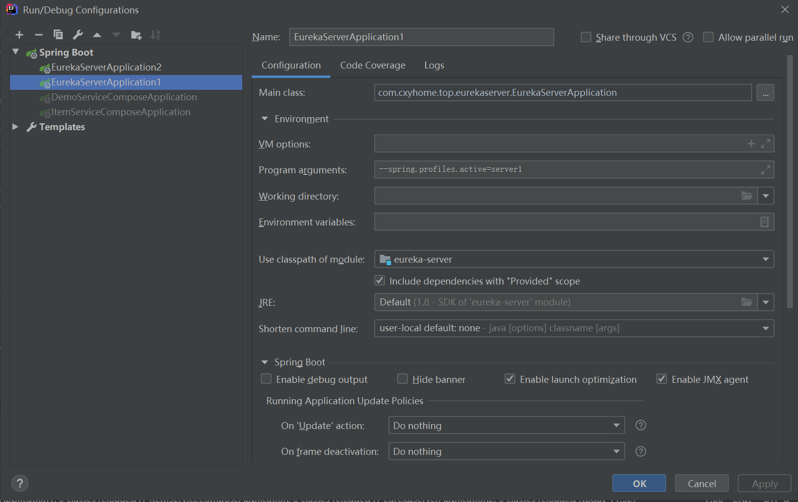

#项目包含
#端口占用
9101  eureka

9102  eureka

9201 api-gateway

9301 config-server

9111  item1

9111  item2

9121  Order
##eureka Server
自己启动多台搭建 集群环境

>账户/密码 jonas/jonas

[访问地址 eureka1](http://localhost:9101 )

[访问地址 eureka2](http://localhost:9102 )

#订单服务
